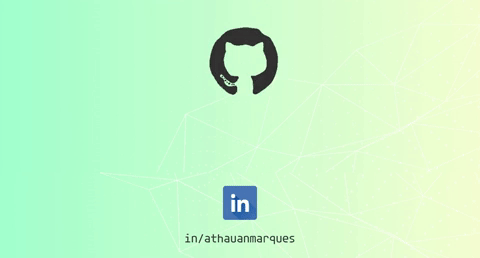

 <a href="https://www.linkedin.com/in/athauanmarques/"></img></a>
<!--  -->

<h3 align="center">A passionate about technology, cryptocurrencies and communities</h3>

- 🔭 I just launched my first APP <a href="https://github.com/athauanmarques/ChistusVeritaqueVia" target="_blank"> Santo Terço</a>

- 👷 I'm working freelancer in <a href="https://agcfreproducoes.com" target="_blank">AGCF Reproduções</a>

- 🌱 I’m currently learning <a href="https://angular.io/">AngularJS</a>

- 📫 How to reach me athauan.marques@gmail.com

- ⚡ Fun fact **I play guitar and go to the GYM very often**

<h3 align="left">Languages and Tools:</h3>

                 

 
  
  
  <h2 align="center">Thanks for visiting! 😄</h2>
 

